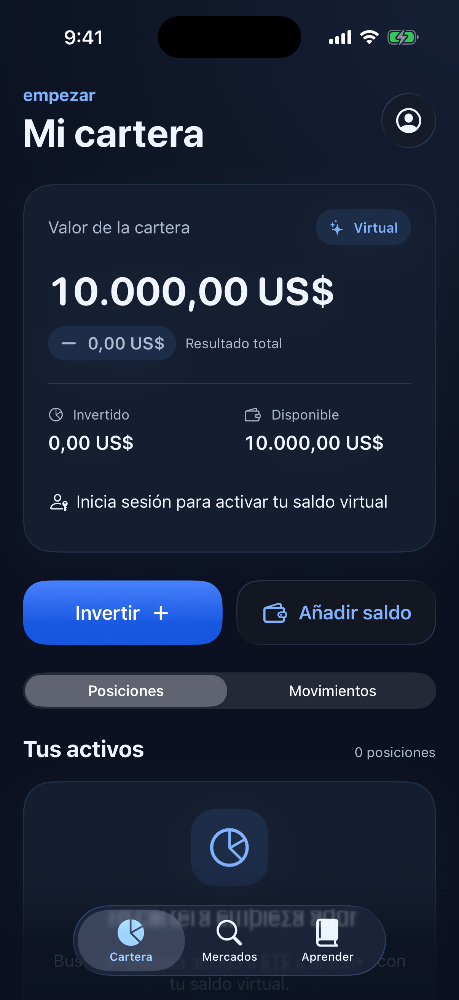
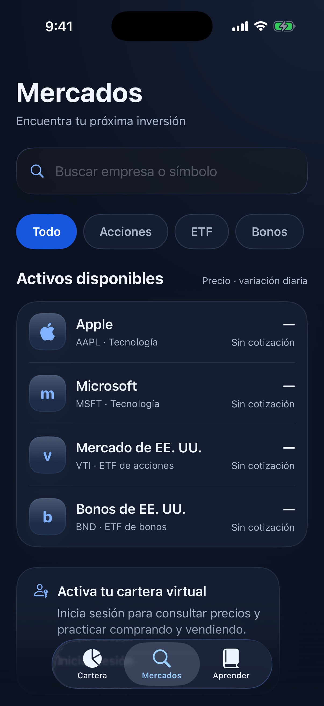
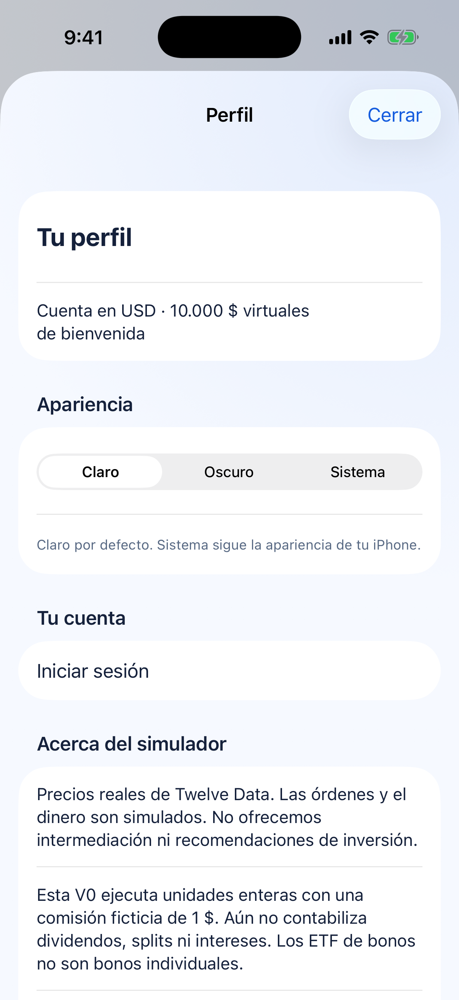
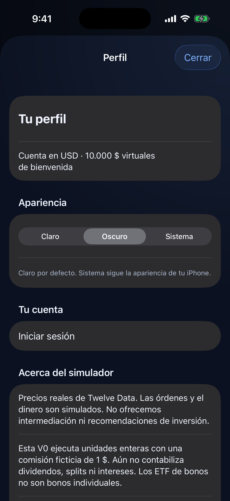
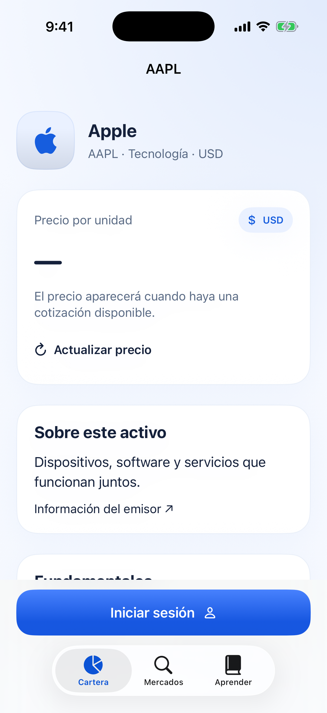
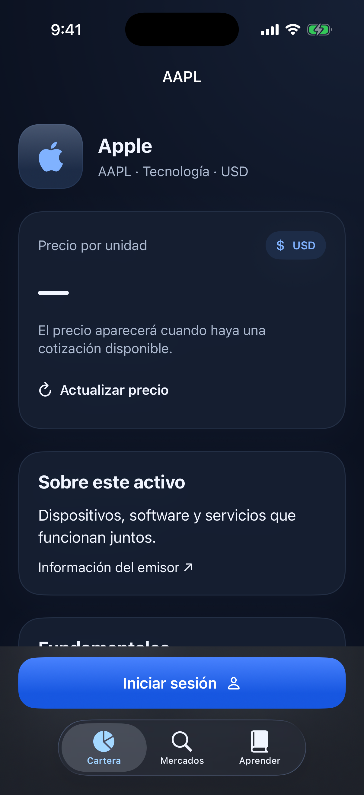
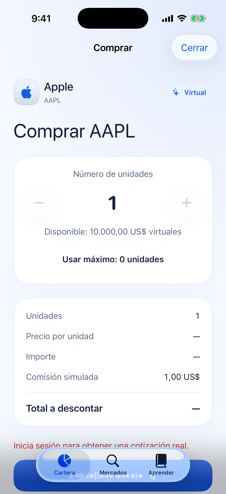
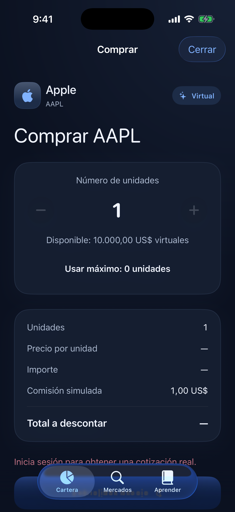
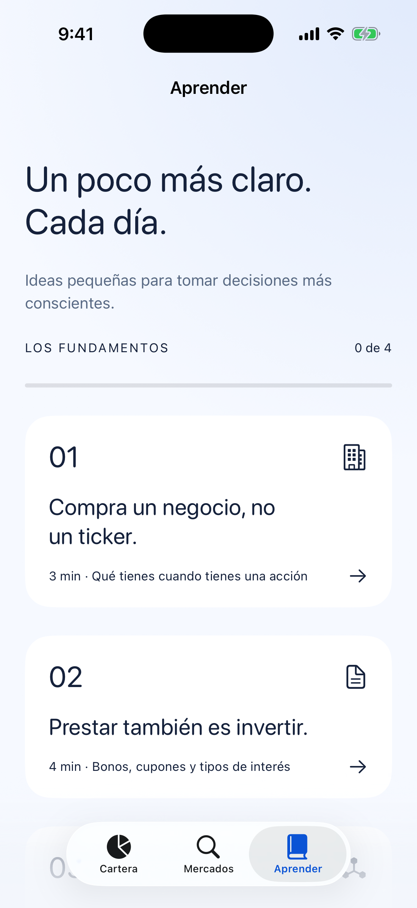
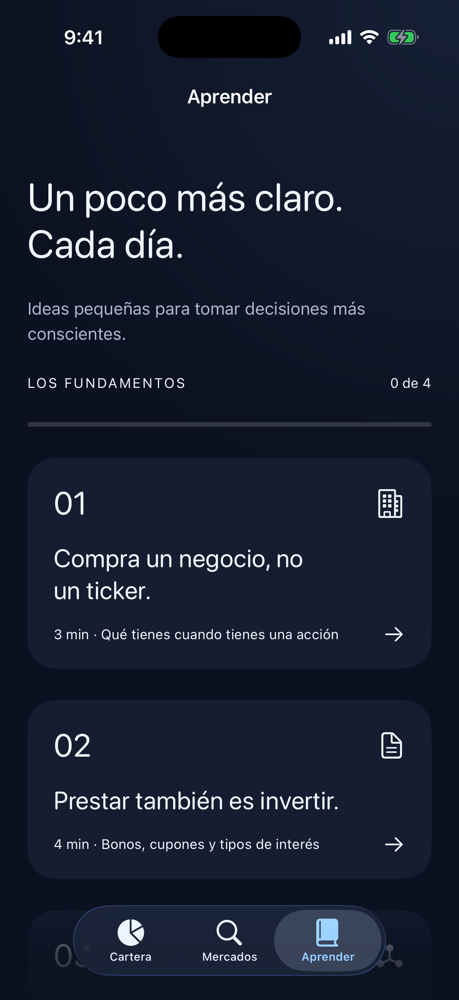

# Capturas nativas de iPhone

Capturadas en el simulador de iOS después de compilar y pasar los tests.
Código de la captura: `c3082d2b5977fa4ef01e1c51ab46ae8f295ab98c`.

Blanco y azul por defecto. El tema se cambia en **Perfil → Apariencia** y se conserva entre sesiones.
Las capturas usan una cuenta sin autenticar: las cotizaciones no disponibles aparecen como `—`, sin precios ni rentabilidades inventados.
Las pantallas de detalle y orden se abren mediante argumentos exclusivos de DEBUG para documentar también su estado sin cotización. No ejecutan compras.

| Pantalla | Claro (por defecto) | Oscuro |
|---|---|---|
| Cartera |  |  |
| Mercados |  |  |
| Perfil y apariencia |  |  |
| Detalle del activo |  |  |
| Compra virtual |  |  |
| Aprender |  |  |
